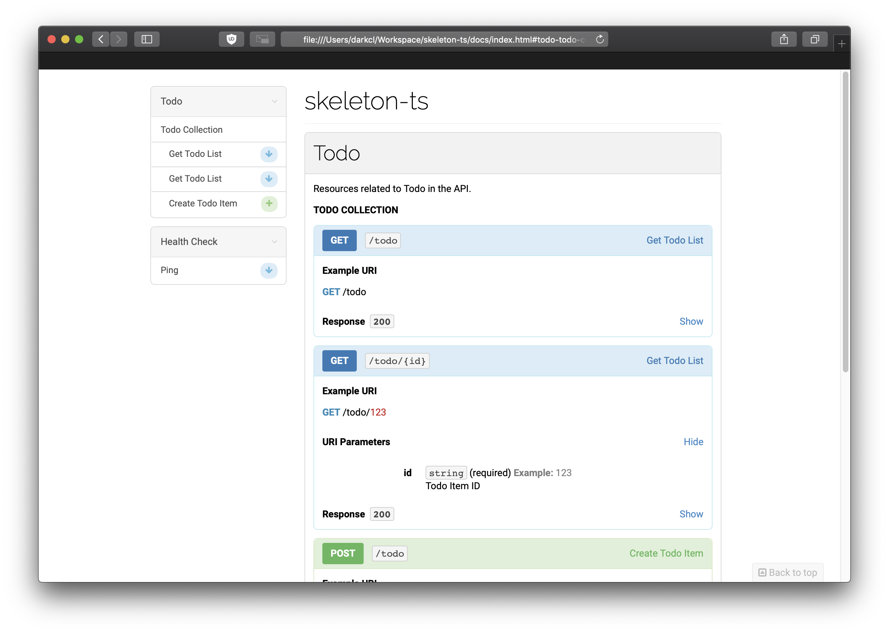

# Writing Documentation

Documentation is the first step to implenent an enpoint.

In this project, we are using [API Blueprint](https://apiblueprint.org)

It provides:

- Clean Syntax for defining RESTful API Specification
- Great tooling including mock server and static site generation
- Integretion tests using API blueprint

## Example: Todo Specification

This section will cover how to define a basic `Todo` endpoint

### Meta Data

The meta data define your API name and API Blueprint version.

```md
FORMAT: 1A

# skeleton-ts
```

### Group

A group is a group for RESTful resources. In this example, it is `Todo`.

```md
# Group Todo

Resources related to Todo in the API.
```

### Collection

Collection is collection of endpoint, in this case, it is `/todo`

```md
## Todo Collection [/todo]
```

### Actions

This is the actions for the collection, for example, getting todo list

```md
### Get Todo List [GET]

- Response 200

  - Attribute (Todo List Response)
```

You can also over-ride the endpoint

```md
### Get Todo Item [GET /todo/{id}]

- Parameters

  - id: `123` (string)

    Todo Item ID

- Response 200

  - Attribute (Todo Response)
```

### Data Structures

In this section you can define what a respone / request object looks like

```md
## Todo Base (object)

- description: `Hello World!` (string)

  Todo item description
```

You can also define nested object

```md
## Todo List Response (object)

- meta (object)

  - status: 200 (number)

- contents (array[Todo Base])
```

## Example: Documentation Website

With `aglio`, you can generate a static html web page for your API spec.

Run the following command in this project to generate the web page.

```sh
make doc
```



## Example: Mock Server

If your team start development for frontend or other module with the backend at the same time. Mocking will be very useful to speed up your team development speed.

`drakov` is include in this project you can start a mock server with your API spec with

```sh
make mock
```
